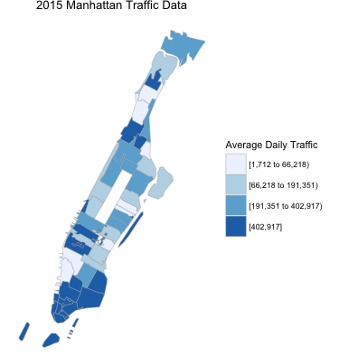
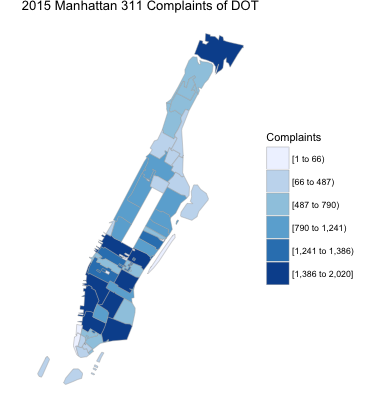

### Analysis of Traffic and Road Condition Complaints

Road condition may have correlation with traffic, since heavy road traffic may do great damage. Thus we combine 311 complaint data related with 2015 Manhattan traffic open data. The traffic data is a document of statistics of traffic by time of the day in each road. We map them to zipcode, and count the daily total traffic.

From the plots above, we can see that the correlation between traffic and road condition complaints is not obvious. Still we can observe some positive relationship between traffic and road condition. It is meaningful, since traffic is only one of many factors for road condition complaints, other factors. 
